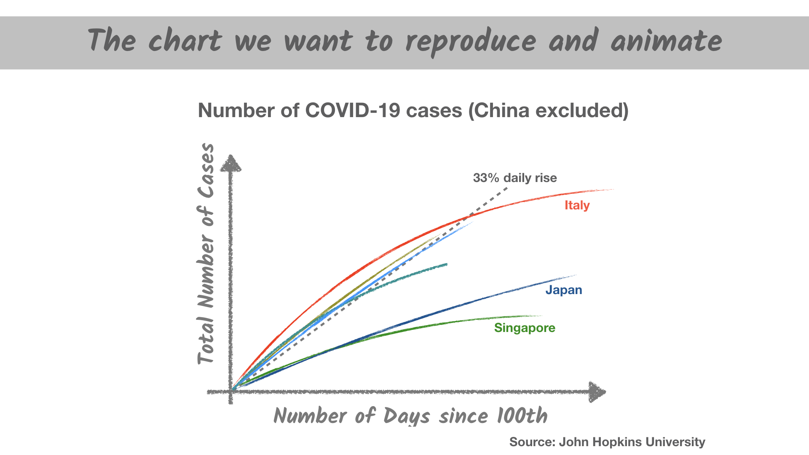
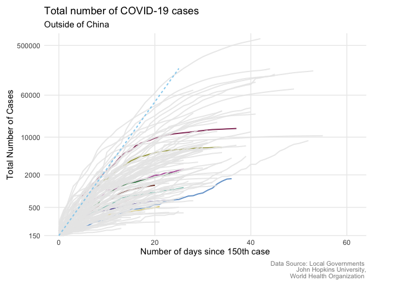
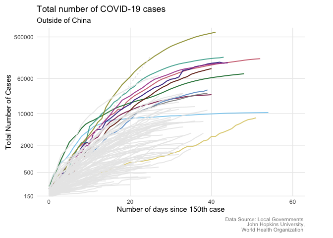
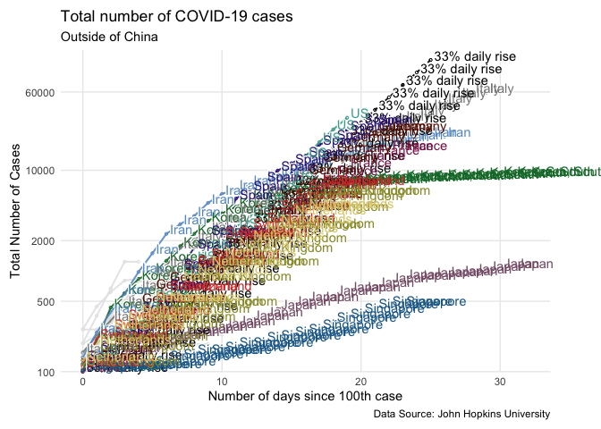
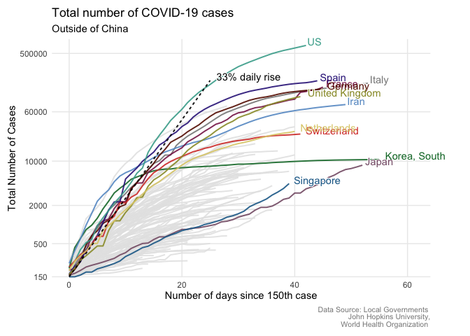
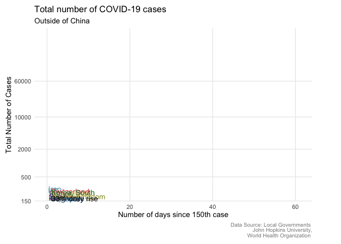

# From static to animated timeseries: the R way

In recent months there have been examples of how to plot timeseries of
COVID-19 confirmed cases all over the web, and you might be overloaded
by the amount of data visualisations that are shared each day on every
possible platform. It is indeed difficult for anyone passionate about
data visualisation to not want to plot the data yourself. For this
reason, in this article we will go through the steps necessary to create
a timeseries plot with R, inspired by the many examples that can be
found on the web: from the Financial Times, [the New York
Times](https://www.nytimes.com/interactive/2020/03/21/upshot/coronavirus-deaths-by-country.html)
and the Economist and so on. In this chart, the number cases since the
150th case are plotted, for each country. As a second step we will then
animate the chart, always in R, using the package `{gganimate}`.



## Importing the data and the libraries

We will import the data from the [data repository of the John Hopkins
University](https://github.com/CSSEGISandData/COVID-19), which collects
data from local governments and the World Health Organization.

As a very first step in our R script or R notebook, we will want to
import all the libraries that we use in this little exercise. We start
with the omnipresent `{tidyverse}`, which allows us to load `{readr}`,
`{tidyr}`, `{dplyr}` and `{ggplot2}` that we will use to import,
manipulate and plot the data. `{lubridate}` is our package of choice for
working with variables that store dates’ values, and `{janitor}` is used
to clean the column names. `{rcartocolor}` contains some very nice color
scales, useful for cartography and more, and finally, we use
`{gganimate}` to animate the chart.

``` r
library(tidyverse)
library(lubridate)
library(janitor)
library(gganimate)
library(rcartocolor)
```


We can now import the data directly from the dataset, which is
continuously updated by John Hopkins University, shared on Github.

``` r
cases_raw <- read_csv("https://raw.githubusercontent.com/CSSEGISandData/COVID-19/master/csse_covid_19_data/csse_covid_19_time_series/time_series_covid19_confirmed_global.csv")
```

``` r
names(cases_raw)
```

    ##  [1] "Province/State" "Country/Region" "Lat"            "Long"          
    ##  [5] "1/22/20"        "1/23/20"        "1/24/20"        "1/25/20"       
    ##  [9] "1/26/20"        "1/27/20"        "1/28/20"        "1/29/20"       
    ## [13] "1/30/20"        "1/31/20"        "2/1/20"         "2/2/20"        
    ## [17] "2/3/20"         "2/4/20"         "2/5/20"         "2/6/20"        
    ## [21] "2/7/20"         "2/8/20"         "2/9/20"         "2/10/20"       
    ## [25] "2/11/20"        "2/12/20"        "2/13/20"        "2/14/20"       
    ## [29] "2/15/20"        "2/16/20"        "2/17/20"        "2/18/20"       
    ## [33] "2/19/20"        "2/20/20"        "2/21/20"        "2/22/20"       
    ## [37] "2/23/20"        "2/24/20"        "2/25/20"        "2/26/20"       
    ## [41] "2/27/20"        "2/28/20"        "2/29/20"        "3/1/20"        
    ## [45] "3/2/20"         "3/3/20"         "3/4/20"         "3/5/20"        
    ## [49] "3/6/20"         "3/7/20"         "3/8/20"         "3/9/20"        
    ## [53] "3/10/20"        "3/11/20"        "3/12/20"        "3/13/20"       
    ## [57] "3/14/20"        "3/15/20"        "3/16/20"        "3/17/20"       
    ## [61] "3/18/20"        "3/19/20"        "3/20/20"        "3/21/20"       
    ## [65] "3/22/20"        "3/23/20"        "3/24/20"        "3/25/20"       
    ## [69] "3/26/20"        "3/27/20"        "3/28/20"        "3/29/20"       
    ## [73] "3/30/20"        "3/31/20"        "4/1/20"         "4/2/20"        
    ## [77] "4/3/20"         "4/4/20"         "4/5/20"         "4/6/20"        
    ## [81] "4/7/20"         "4/8/20"         "4/9/20"         "4/10/20"       
    ## [85] "4/11/20"        "4/12/20"        "4/13/20"        "4/14/20"       
    ## [89] "4/15/20"

In order to recreate the chart, inspired by John Burn-Murdoch’s work, we
need to tidy the data first, and then do some basic manipulation of it.
Since each column corresponds to the different dates, the first thing to
do would be to transform the data from wide format to long format: for
this we use the `pivot_longer()` function from the `{tidyr}` package.

We will also try to be smart here, and select for our pivoting only the
columns that are named as a date in the following format:
“digit/digit/digit”. The new column `date` will need to be transformed
into a date column, and to do this we can use the smart `mdy()` function
from the `{lubridate}` package: where `m` stands for *month*, `d` stands
for *day* and `y` stands for *year*.

In the rest of the script we will keep only those `country_regions` that
we want to plot. We will also filter out the China data because it is a
bit off scale compared to the other countries, but this may not be valid
in few weeks time, given the unfortunately fast pace at which the
pandemic has spread.

In the `country_region` column, some countries are reported by
subregions but we actually want only one value per day per country. We
will therefore use the `group_by()` and `summarise()` to make sure that
this is the case, and that this corresponds to the sum of cases in all
the regions in each country.

``` r
cases_data <- cases_raw %>%
  pivot_longer(cols= matches("\\d+/\\d+/\\d+"), 
               names_to = "date", 
               values_to = "cases") %>% 
  clean_names() %>% 
  transmute(country_region, date = mdy(date), cases) %>% 
  filter(!country_region %in% c("Others" ,"China","Diamond Princess")) %>%
  group_by(country_region, date) %>% 
  summarise(cases = sum(cases))
```

Now `cases_data` is beginning to looking tidy (one row per country per
date and just one column storing the cases) - what a joy for the eyes\!

``` r
head(cases_data)
```

    ## # A tibble: 6 x 3
    ## # Groups:   country_region [1]
    ##   country_region date       cases
    ##   <chr>          <date>     <dbl>
    ## 1 Afghanistan    2020-01-22     0
    ## 2 Afghanistan    2020-01-23     0
    ## 3 Afghanistan    2020-01-24     0
    ## 4 Afghanistan    2020-01-25     0
    ## 5 Afghanistan    2020-01-26     0
    ## 6 Afghanistan    2020-01-27     0

If we just wanted to plot the raw timeseries, this would be enough.
However, we want to go a bit further than this and plot the dates since
the 150th case in each country. We also want to keep only the countries
that reached the 150th case from more than 9 days, so as not to have an
overcrowded chart. By group, we will again calculate the days since the
150th case and for good practice we will then `ungroup()` the data.

``` r
cases_data <- cases_data %>% 
  filter(cases >= 150)%>%
  filter(n() >= 10) %>%
  arrange(date, .by_group = TRUE)%>%
  mutate(days_since_150 = (date-first(date)) / ddays(1)) %>%
  ungroup()
```

Many visualisations that can be found on the web or in newspapers add to
the country trend lines a dashed line that corresponds to the 33% daily
rise. We will then add it to our original `tibble` (which is just
another way to say table in `tidyverse` language). We will also create a
new variable `line_type` that we will use to set the line corresponding
to the `33% daily rise` to be a dashed line, in our plot.

``` r
cases_data <- cases_data %>% 
  bind_rows(
    tibble(country_region = "33% daily rise", 
           days_since_150 = 0:25) %>%
      mutate(cases = 150*1.33^days_since_150)
  ) %>% 
  mutate(line_type = ifelse(country_region == "33% daily rise", "2", "1")) 
```

Now we can make our first attempt at plotting, using the `{ggplot2}`
library. To do this, we will map the `color` aesthetic to the
`country_region` column. This will apply a different color to each
country (in the chosen color scale). Beware that most categorical color
scales do not have more than 12 colors, therefore the last color of the
scale will be repeated for as many times as is necessary to cover all
the extra countries. We will also transform the y-axis to a logarithmic
scale, using `scale_y_log10()`. The rest of the code is done to set a
color scale and to set a theme to the plot, as well as all the
annotations.

``` r
ggplot(data = cases_data, 
       mapping = aes(x = days_since_150, 
                     y = cases, 
                     color = country_region)) +
  #add the lines to the chart
  geom_line(size = 0.7, alpha =0.9,
            mapping = aes(linetype = line_type)) +
  # set the x axis to have a little more space for annotations
  scale_x_continuous(limits = c(0, max(cases_data$days_since_150) +6))+
  # set the y axis to be log10
  scale_y_log10(expand = expansion(add = c(0,0.1)), 
                breaks=c(150, 500, 2000,  10000, 60000, 500000)) +
  # use the palette Safe from the rcartocolor package
  scale_color_carto_d(palette = "Safe")+
  # set the theme to minimal
  theme_minimal() +
  # customise the theme a bit more
  theme(
    panel.grid.minor = element_blank(),
    # remove legend
    legend.position = "none",
    # change margin size
    plot.margin = margin(3,15,3,3,"mm"),
    # set the caption to be written as HTML code
    plot.caption = ggtext::element_markdown() 
  ) +
  # allow points to be plotted outside of plot area
  coord_cartesian(clip = "off") +
  # customise all the labels in the chart
  labs(x = "Number of days since 150th case", 
       y = "Total Number of Cases",
       title = "Total number of COVID-19 cases",
       subtitle =  "Outside of China",
       caption = "<span style = 'font-size:8pt;color:#888888'>Data Source: Local Governments <br> John Hopkins University,<br> World Health Organization </span>")
```

<!-- -->

This was a first attempt but we can already see that there is one
problem with this visualisation: the colours. The number of countries
plotted is indeed too big for many categorical colour scales. If we
plotted each line in a different colour we would not be able to really
discern the countries. If we want to still use different colours for the
countries that we want to highlight we need to give an order to the
countries, based on the data (i.e. based on the maximum value of
`days_since_150`, for each country). To do so we can use the
`fct_infreq()` from the `{forcats}` package.

``` r
cases_data <- cases_data %>% 
  mutate(country_region = fct_infreq(country_region))
```

`fct_infreq()` orders the factors by their frequency. The countries will
therefore be ordered by the number of corresponding observations (rows)
in the country. Countries that have more rows (more days since the 150th
case) will come first. We can now plot the datab again, using the same
code as before.

``` r
ggplot(data = cases_data, 
       mapping = aes(x = days_since_150, 
                     y = cases, 
                     color = country_region)) +
  geom_line(size = 0.7, alpha =0.9,
            mapping = aes(linetype = line_type)) +
  scale_x_continuous(limits = c(0, max(cases_data$days_since_150) +6))+
  scale_y_log10(expand = expansion(add = c(0,0.1)), 
                breaks=c(150, 500, 2000,  10000, 60000, 500000)) +
  scale_color_carto_d(palette = "Safe")+
  theme_minimal() +
  theme(
    panel.grid.minor = element_blank(),
    legend.position = "none",
    plot.margin = margin(3,15,3,3,"mm"),
    plot.caption = ggtext::element_markdown()
  ) +
  coord_cartesian(clip = "off") +
  labs(x = "Number of days since 150th case", 
       y = "Total Number of Cases",
       title = "Total number of COVID-19 cases",
       subtitle =  "Outside of China",
       caption = "<span style = 'font-size:8pt;color:#888888'>Data Source: Local Governments <br> John Hopkins University,<br> World Health Organization </span>")
```

<!-- -->

## Annotating the plot

If we want to annotate the plot with the name of each country, we can
then use `geom_text()` in our `ggplot` call. We can place the annotation
next to the last point of each line by using a different `tibble` for
the annotation. In `annotations` we will just keep the observation
corresponding to the maximum value of `days_since_150`, for each county.
If we want to only annotate the first 12 countries (12 because the
colour scale we have chosen has 12 colours), we can create a new
variable named `label_country`, that will be empty for all countries
apart from the first 12, ordered before using the `fct_infreq()`.

``` r
annotations <- cases_data %>% 
  group_by(country_region) %>% 
  filter(days_since_150 == max(days_since_150)) %>% 
  mutate(label_country = ifelse(country_region %in% levels(country_region)[1:12],
                                 as.character(country_region), ""))
```

Now we are ready to annotate the plot. To increase the visibility of the
labels we can use `geom_shadowtext()` from the `{shadowtext}` package,
which adds a subtle little 3d look, which makes the labels stand out a
little bit. As we all know, the devil is in the details\!

``` r
ggplot(data = cases_data, 
       mapping = aes(x = days_since_150, 
                     y = cases, 
                     color = country_region)) +
  geom_line(size = 0.7, alpha =0.9,
            mapping = aes(linetype = line_type)) +
  scale_x_continuous(limits = c(0, max(cases_data$days_since_150) +6))+
  scale_y_log10(expand = expansion(add = c(0,0.1)), 
                breaks=c(150, 500, 2000,  10000, 60000, 500000)) +
  shadowtext::geom_shadowtext(data = annotations, 
                              mapping = aes(x = days_since_150, 
                                            y = cases, 
                                            label = label_country),
                              hjust=-0.1, vjust = 0, bg.color = "white") +
  scale_color_carto_d(palette = "Safe")+
  theme_minimal() +
  theme(
    panel.grid.minor = element_blank(),
    legend.position = "none",
    plot.margin = margin(3,15,3,3,"mm"),
    plot.caption = ggtext::element_markdown()
  ) +
  coord_cartesian(clip = "off") +
  labs(x = "Number of days since 150th case", 
       y = "Total Number of Cases",
       title = "Total number of COVID-19 cases",
       subtitle =  "Outside of China",
       ccaption = "<span style = 'font-size:8pt;color:#888888'>Data Source: Local Governments <br> John Hopkins University,<br> World Health Organization </span>")
```

<!-- -->

Now, how do we plot the colored line on top of the grey lines? To do
this, we would need to reorder the `country_region` factors again, but
this would affect the way the the lines are coloured. How can we cope
with this?

The way to do it is to manually set the color of the countries, and then
order the countries in the reverse order from the one we used before. A
little hacky trick, indeed. The hex values corresponding to the colors
were taken directly from the
[carto.com](https://carto.com/carto-colors/) webpage.

``` r
cases_data <- cases_data %>% 
  mutate(color_label = forcats::fct_collapse(country_region,
    "#D63D32" = "Switzerland",
    "#888888" = "Italy",
    "#6699CC" = "Iran",
    "#661100" = "Germany",
    "#882255" = "France",
    "#999933" = "United Kingdom",
    "#44AA99" = "US",
    "#332288" = "Spain",
    "#117733" = "Korea, South",
    "#DDCC77" = "Netherlands",
    "#CC503E" = "Hong Kong",
    "#1D6996" = "Singapore",
    "#855C75" = "Japan",
    "black"   = "33% daily rise",
    other_level = "grey90"),
    color_label = fct_relevel(color_label, "grey90")) %>%
  arrange(color_label) %>%
  mutate(country_region = fct_inorder(country_region)) %>% 
  mutate(country_label = ifelse(color_label == "grey90", "", as.character(country_region)))
```

``` r
annotations <- cases_data %>% 
  group_by(country_region) %>% 
  filter(days_since_150 == max(days_since_150))
```

``` r
ggplot(data = cases_data, 
       mapping = aes(x = days_since_150, 
                     y = cases, 
                     color = color_label,
                     group = country_region)) +
  geom_line(mapping = aes(linetype = line_type), 
            size = 0.7, alpha =0.9) +
  scale_x_continuous(limits = c(0, max(cases_data$days_since_150) +6))+
  scale_y_log10(expand = expansion(add = c(0,0.1)), 
                breaks=c(150, 500, 2000,  10000, 60000, 500000)) +
  theme_minimal() +
  scale_color_identity()+
  shadowtext::geom_shadowtext(data = annotations, 
                              mapping = aes(x = days_since_150, 
                                            y = cases, 
                                            label = country_label),
                              hjust=-0.1, vjust = 0, bg.color = "white") +
  theme(
    panel.grid.minor = element_blank(),
    legend.position = "none",
    plot.margin = margin(3,15,3,3,"mm"),
    plot.caption = ggtext::element_markdown()
  )+
  coord_cartesian(clip = "off") +
  labs(x = "Number of days since 150th case", 
       y = "Total Number of Cases",
       title = "Total number of COVID-19 cases",
       subtitle =  "Outside of China",
       caption = "<span style = 'font-size:8pt;color:#888888'>Data Source: Local Governments <br> John Hopkins University,<br> World Health Organization </span>")
```

<!-- -->

## Animating the plot

How do we animate the plot? Luckily, the developers of the `{gganimate}`
package thought about us and made the animation very easy to implement
to any chart created using `{ggplot2}`. We really need to add one
function: `transition_reveal()`. This will allow us to reveal the lines
along the x-axis, one day at the time. For the animation, we will not
use the `annotation` dataset anymore, as we want to have the annotation
to appear at each point of the chart.

``` r
ggplot(data = cases_data, 
       mapping = aes(x = days_since_150, 
                     y = cases, 
                     color = color_label,
                     group = country_region)) +
  geom_line(mapping = aes(linetype = line_type), 
            size = 0.7, alpha =0.9) +
  scale_x_continuous(limits = c(0, max(cases_data$days_since_150) +6))+
  scale_y_log10(expand = expansion(add = c(0,0.1)), 
                breaks=c(150, 500, 2000,  10000, 60000)) +
  theme_minimal() +
  scale_color_identity()+
  # we change the data to cases_data
  shadowtext::geom_shadowtext(data = cases_data, 
                              mapping = aes(x = days_since_150, 
                                            y = cases, 
                                            label = country_label),
                              hjust=-0.1, vjust = 0, bg.color = "white") +
  theme(
    panel.grid.minor = element_blank(),
    legend.position = "none",
    plot.margin = margin(3,15,3,3,"mm"),
    plot.caption = ggtext::element_markdown()
  )+
  coord_cartesian(clip = "off") +
  labs(x = "Number of days since 150th case", 
       y = "Total Number of Cases",
       title = "Total number of COVID-19 cases",
       subtitle =  "Outside of China",
       caption = "<span style = 'font-size:8pt;color:#888888'>Data Source: Local Governments <br> John Hopkins University,<br> World Health Organization </span>") +
  transition_reveal(days_since_150) 
```

<!-- -->

We can also save the animation to a .gif file, using the `anim_save()`
function from the `{gganimate}` package.

``` r
anim_save("covid.gif")
```

We have now created an animation from a simple line chart in R. This
type of work flow is indeed applicable to any time we want to create
plot, annotate, and animate a line chart. Hopefully now, when you see a
COVID-19 related chart, you will also be interested in how to replicate
it and - because why not? - animate it.

Beware that these data are updated continuously and the input file
format may change (file name or even column names). I would suggest you
to check the [github page of the John Hopkins
University](https://github.com/CSSEGISandData/COVID-19) from time to
time, to both see what data is available and if the file names changed.
