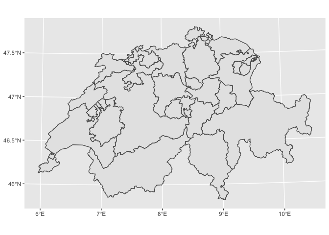
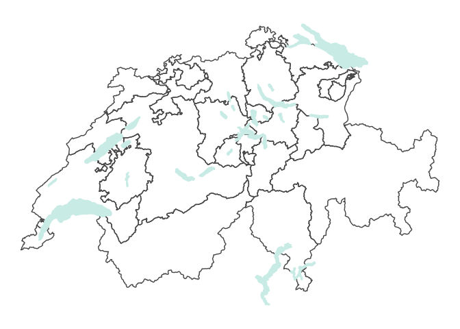
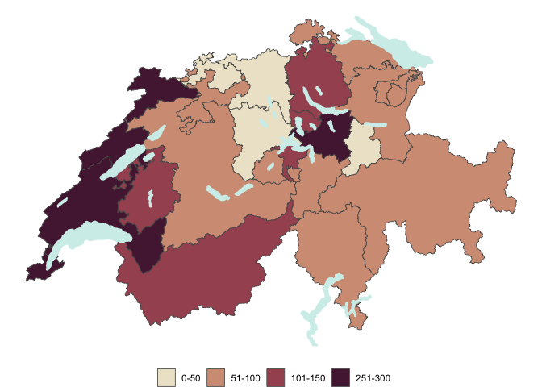
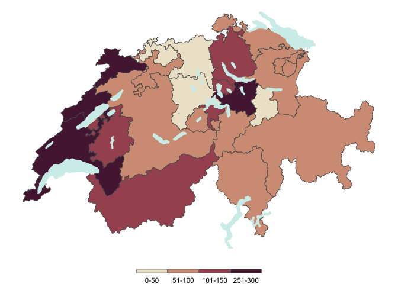
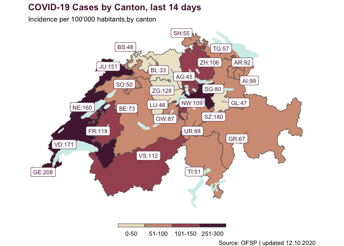

Making a map of COVID-19 incidence in Switzerland using {ggplot2} and
`{sf}`
================

In the past years, creating beautiful maps in R has become fairly
simple, thanks to the `{sf}` package. In this article, we are going to
visualise the spatial distribution of COVID-19 incidence, in the last 14
days in Switzerland, by creating a thematic map, also known as
*choropleth* map. Previously, we had explored how to visualise and
animate COVID-19 time series data, using `{ggplot2}` and `{gganimate}`.

This time, we are going to rely on `{sf}` and `{ggplot2}` as our main
tools.

`{sf}`, which stands for simple feature, is the go-to library to deal
with spatial vectorial data, which is data that describes geographical
geometries as a series of points, that are described by their
*longitude* and the *latitude* coordinates. It allows for importing,
manipulating and plotting geographical shapes, letting us deal with data
in table-like format, just like a data.frame. Such a relief\!

In this little exercise, we are using `{readxl}` to import the excel
file, downloaded from the [Swiss Federal Office of Public Health
Website](https://www.bag.admin.ch/bag/en/home/krankheiten/ausbrueche-epidemien-pandemien/aktuelle-ausbrueche-epidemien/novel-cov/situation-schweiz-und-international.html).
`{rcartocolor}` is the R library that includes nice looking colour
scales, that have been developed for cartography. As David Letterman
would say, `{tidyverse}` needs no introduction.

``` r
library(tidyverse)
library(sf)
library(rcartocolor)
library(readxl)
```

Let’s start loading the data, using `read_excel()`, in which we can
define the exact name of the `sheet` that we want to load, how many
lines we may `skip` and how many lines we want to `keep` overall. We
have one row per canton and a row for the title, which means that we
need to keep only 27 rows (the Swiss cantons are 26).

We also clean a bit the column names using the `clean_names` from the
`{janitor}` package and use `transmute` to rename the wanted columns and
drop the others.

> Until now, simple data import and manipulation.

``` r
covid_incidence <- read_excel("resources/200325_dati di base_grafica_COVID-19-rapporto.xlsx", 
    sheet = "COVID19 casi per cantone", skip = 6, 
    n_max = 27) %>% 
  janitor::clean_names() %>% 
  transmute(canton = cantone, incidence = incidenza_100_000_6)
```

    ## New names:
    ## * `Casi confermati` -> `Casi confermati...2`
    ## * `Incidenza/100 000` -> `Incidenza/100 000...3`
    ## * `` -> ...4
    ## * `Casi confermati` -> `Casi confermati...5`
    ## * `Incidenza/100 000` -> `Incidenza/100 000...6`

``` r
head(covid_incidence)
```

    ## # A tibble: 6 x 2
    ##   canton incidence
    ##   <chr>      <dbl>
    ## 1 AG          45.1
    ## 2 AI          99.1
    ## 3 AR          92.3
    ## 4 BE          73  
    ## 5 BL          33  
    ## 6 BS          47.7

We have now one variable which contains the canton codes, and one
variable that contains the incidence per 100’000, by canton, of COVID-19
in the last 14 days.

We are now ready to load the **shapefiles**.

> Wait, what are the shapefiles?

Shapefiles, are the files that contain the geographical shapes that we
want to plot. We want to plot the cantonal data, so we need to get the
swiss cantons shapes, which can be downloaded from
[here](https://www.bfs.admin.ch/bfs/en/home/services/geostat/swiss-federal-statistics-geodata/administrative-boundaries/generalized-boundaries-local-regional-authorities.html).

Shapefiles are actually a set of files, which contain different
geographic infos (e.g. info on the projections). One of these files, has
the `.shp` extension and this is the one that we are going to load.

> Beware that you need to have all the other files in the same folder.

Now we can therefore load 2 shapefiles, one that contains the shapes of
the canton borders and one that contains the shape of the major lakes of
Switzerland.

Let’s load them and see how they look like.

``` r
swiss_lakes <- st_read("resources/g2s15.shp")
```

    ## Reading layer `g2s15' from data source `/Users/gruggeri/Documents/ADSCV/medium_articles/ADSCV_medium/covid_swiss_map/resources/g2s15.shp' using driver `ESRI Shapefile'
    ## Simple feature collection with 22 features and 9 fields
    ## geometry type:  MULTIPOLYGON
    ## dimension:      XY
    ## bbox:           xmin: 500253.8 ymin: 63872.4 xmax: 774495.3 ymax: 297632.2
    ## projected CRS:  CH1903 / LV03

``` r
swiss_cantons <- st_read("resources/G1K09.shp")
```

    ## Reading layer `G1K09' from data source `/Users/gruggeri/Documents/ADSCV/medium_articles/ADSCV_medium/covid_swiss_map/resources/G1K09.shp' using driver `ESRI Shapefile'
    ## Simple feature collection with 26 features and 3 fields
    ## geometry type:  MULTIPOLYGON
    ## dimension:      XY
    ## bbox:           xmin: 485414 ymin: 75286 xmax: 833837 ymax: 295935
    ## projected CRS:  CH1903 / LV03

``` r
class(swiss_cantons)
```

    ## [1] "sf"         "data.frame"

`swiss_cantons` and `swiss_lakes`, are stored as `sf data.frame`s, so we
can manipulate them just like we manipulate tibbles (or data.frames).
This is possible because geometries are stored in a very tidy way: as a
nested variable usually called `geometry`. This will be your only
*special* variable, the others (that are called attributes) will just be
normal variables. For instance, each canton as its name and code
associated to the geometry that describes it.

``` r
head(swiss_cantons)
```

    ## Simple feature collection with 6 features and 3 fields
    ## geometry type:  MULTIPOLYGON
    ## dimension:      XY
    ## bbox:           xmin: 546871 ymin: 130593 xmax: 768722 ymax: 295935
    ## projected CRS:  CH1903 / LV03
    ##   KT         NAME KURZ                       geometry
    ## 1 17   St. Gallen   SG MULTIPOLYGON (((738559 1968...
    ## 2 12  Basel-Stadt   BS MULTIPOLYGON (((608728 2681...
    ## 3  7    Nidwalden   NW MULTIPOLYGON (((671030 1822...
    ## 4  2         Bern   BE MULTIPOLYGON (((572954 1936...
    ## 5 14 Schaffhausen   SH MULTIPOLYGON (((684561 2726...
    ## 6 10     Fribourg   FR MULTIPOLYGON (((584435 1976...

> The advantage of using `{sf}` as our main tool to deal with these data
> types? We can use `{ggplot2}` to plot it\!

``` r
ggplot()+
  geom_sf(data = swiss_cantons)
```

<!-- -->

And, just like with any `{ggplot2}` chart, we can reason layer by layer
when building map. Let’s now add the Swiss lakes on top of the canton
shapes and use `theme_void()` to remove the background and the axis. In
this step, we can also make the cantons transparent by setting the
`fill` argument to NA and add a light teal colour fill the lakes.
`geom_sf()` indeed works just like any other `geom_` function, no alarms
and no surprises here.

``` r
ggplot()+
  geom_sf(data = swiss_cantons, fill = NA) +
  geom_sf(data = swiss_lakes,  fill = "#d1eeea", color = "#d1eeea") +
  theme_void()
```

<!-- -->

Now, how to colour each canton by the magnitude of COVID-19 incidence
per 100’000 people?

We just need to join the `covid_incidence` tibble and `swiss_cantons`
table together, using the canton code as joining variable. This will
allow us to map the variable incidence to the `fill` aesthetic and
create a **choropleth** map, i.e. a thematic map.

``` r
swiss_cantons <- swiss_cantons %>% 
  left_join(covid_incidence, c("KURZ" = "canton"))
```

To make our map look pretty, instead of using a numerical variable we
divide the incidence into categories, so that it will be easier for the
user to see in which category each canton is.

This a typical practice for choropleth maps, and it can be done in
different ways, in this case we decide for a brut-force approach, we do
it manually.

``` r
swiss_cantons <- swiss_cantons %>% 
  mutate(incidence_cat = case_when(
    incidence <= 50 ~ "0-50",
    incidence <= 100 ~ "51-100",
    incidence <= 150 ~ "101-150",
    incidence <= 300 ~ "251-300"
  )) %>% 
  mutate(incidence_cat = factor(incidence_cat, levels = c("0-50", "51-100","101-150","151-200","251-300")))
```

Now we can map the colour to the `incidence_cat` variable and create the
first choropleth map.

``` r
ggplot(swiss_cantons) +
  geom_sf(aes(fill = incidence_cat), size = 0.3) +
  scale_fill_carto_d(palette = "BrwnYl") +
  geom_sf(data = swiss_lakes, fill = "#d1eeea", color = "#d1eeea")+
  theme_void() +
  theme(legend.title = element_blank(),
        legend.position = "bottom") 
```

<!-- -->

And we have our first choropleth map, built only using `{sf}` and
`{ggplot2}`. Let add some finishing touches: we are not happy with how
the legend looks like and we can change it using `guide_legend()`.

``` r
ggplot(swiss_cantons) +
  geom_sf(aes(fill = incidence_cat), size = 0.3) +
  scale_fill_carto_d(palette = "BrwnYl",
                     guide = guide_legend(direction = "horizontal",
            keyheight = unit(2, units = "mm"),
            keywidth = unit(70 / 5, units = "mm"),
            title.position = 'top',
            title.hjust = 0.5,
            label.hjust = 0.5,
            nrow = 1,
            byrow = T,
            label.position = "bottom")) +
  geom_sf(data = swiss_lakes, fill = "#d1eeea", color = "#d1eeea")+
  theme_void() +
  theme(legend.title = element_blank(),
        legend.position = "bottom") 
```

<!-- -->

Now we can add a title, a subtitle and labels on top of each canton. We
will use `{ggrepel}` to make sure the labels will not overlap with each
other, we will also use `{ggtext}` so we can use markdown syntax for our
title and subtitle.

``` r
ggplot(swiss_cantons) +
  geom_sf(aes(fill = incidence_cat), size = 0.3) +
  scale_fill_carto_d(palette = "BrwnYl",
                     guide = guide_legend(direction = "horizontal",
            keyheight = unit(2, units = "mm"),
            keywidth = unit(70 / 5, units = "mm"),
            title.position = 'top',
            title.hjust = 0.5,
            label.hjust = 0.5,
            nrow = 1,
            byrow = T,
            label.position = "bottom")) +
  geom_sf(data = swiss_lakes, fill = "#d1eeea", color = "#d1eeea")+
  ggrepel::geom_label_repel(
    data = swiss_cantons,
    aes(label = paste0(KURZ,":",round(incidence, digits = 0)), 
        geometry = geometry),
    stat = "sf_coordinates",
    min.segment.length = 0.2,
    colour = "#541f3f",
    size = 3,
    segment.alpha = 0.5
  ) +
  labs(title = "<b style='color:#541f3f'> COVID-19 Cases by Canton, last 14 days </b>",
       subtitle = "<span style='font-size:10pt'>Incidence per 100'000 habitants,by canton </span>",
       caption = "Source: OFSP | updated 12.10.2020") +
  theme_void() +
  theme(legend.title = element_blank(),
        legend.position = "bottom",
        plot.title = ggtext::element_markdown(),
        plot.subtitle = ggtext::element_markdown()) 
```

<!-- -->

We have now the code to create a choropleth map and we have seen how to
build it step by step using `{ggplot2}`. With a little bit of
customisation we have now a static map that we save in different format
and share.

If you are interested in how to deal with geographical data, one of the
best freely available resource is the [geocomputation with R
book](https://geocompr.robinlovelace.net). The authors of the book rely
heavily of different packages for plotting thematic maps, namely
`{tmap}`, which is also worth exploring. If you want to use packages
such as `{ggtext}` to customise your plots, `{ggplot2}` is the library
that you want to rely on, especially if you are already used to work
with it.

I hope you enjoyed this article and stay tuned for more example on how
to build maps in R.
