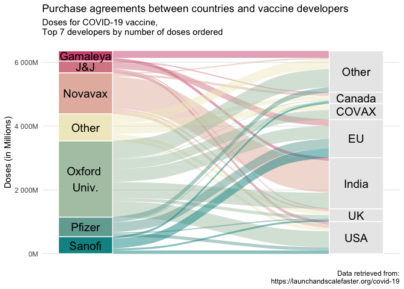

Vaccines
================

``` r
library(tidyverse)
```

    ## ── Attaching packages ─────────────────────────────────────────────────────── tidyverse 1.3.0 ──

    ## ✓ ggplot2 3.3.2     ✓ purrr   0.3.4
    ## ✓ tibble  3.0.3     ✓ dplyr   1.0.2
    ## ✓ tidyr   1.1.2     ✓ stringr 1.4.0
    ## ✓ readr   1.4.0     ✓ forcats 0.5.0

    ## ── Conflicts ────────────────────────────────────────────────────────── tidyverse_conflicts() ──
    ## x dplyr::filter() masks stats::filter()
    ## x dplyr::lag()    masks stats::lag()

``` r
library(readxl)
library(ggalluvial)
```

(<https://launchandscalefaster.org/COVID-19>)

``` r
vaccines <- read_excel("sankey.xlsx") %>% 
  pivot_longer(cols = -country) %>% 
  filter(!is.na(value)) %>% 
  mutate(name_2 = fct_lump_n(name, n = 6, w = value)) %>% 
  mutate(country_2 = fct_lump_n(country, n = 6, w = value)) %>% 
  select(-name, - country) %>% 
  group_by(name_2, country_2) %>% 
  summarise(value  = sum(value, na.rm = TRUE)) %>% 
  mutate(name_2 = fct_reorder(name_2, value, sum)) 
```

    ## `summarise()` regrouping output by 'name_2' (override with `.groups` argument)

``` r
nameschange <- tibble(name_2 = c("Gamaleya Research Institute", 
                                 "Janssen (J&J)", 
                                 "Novavax", 
                                 "Oxford University", 
                                 "Pfizer", 
                                 "Sanofi-GSK", 
                                 "Other"),
                      new_name = c("Gamaleya",
                                   "J&J",
                                   "Novavax",
                                   "Oxford \nUniv.",
                                   "Pfizer",
                                   "Sanofi",
                                   "Other")
)

vaccines <- vaccines %>% 
  left_join(nameschange, "name_2")

ggplot(
  as.data.frame(vaccines),
  aes(
    y = value,
    axis1 = new_name,
    axis2 = country_2
  )
) +
  geom_alluvium(aes(fill = new_name), width = 1 / 5) +
  geom_stratum(width = 1 / 5, aes(fill = new_name), color = "white") +
  geom_text(
    stat = "stratum", size = 5,
    aes(label = new_name)
  ) +
  geom_text(aes(label = country_2),
    stat = "stratum",
    width = 1 / 4,
    size = 5
  ) +
  rcartocolor::scale_fill_carto_d(palette = "TealRose", direction = -1) +
  scale_y_continuous(labels = scales::label_number(scale = 1 / 1e6, suffix = "M")) +
  #scale_x_discrete(limits = c("", "")) +
  labs(
    title = "Purchase agreements between countries and vaccine developers",
    subtitle = "Doses for COVID-19 vaccine, \nTop 7 developers by number of doses ordered",
    caption = "Data retrieved from:\n https://launchandscalefaster.org/covid-19",
    y = "Doses (in Millions)"
  ) +
  theme_minimal() +
  theme(
    legend.position = "none",
    panel.grid.minor.y = element_blank(),
    axis.title.x=element_blank(),
        axis.text.x=element_blank(),
        axis.ticks.x=element_blank(),
    panel.grid.major.x = element_blank(),
    panel.grid.minor.x = element_blank()
  )
```

    ## Warning: Ignoring unknown parameters: width

    ## Warning in to_lodes_form(data = data, axes = axis_ind, discern =
    ## params$discern): Some strata appear at multiple axes.
    
    ## Warning in to_lodes_form(data = data, axes = axis_ind, discern =
    ## params$discern): Some strata appear at multiple axes.
    
    ## Warning in to_lodes_form(data = data, axes = axis_ind, discern =
    ## params$discern): Some strata appear at multiple axes.
    
    ## Warning in to_lodes_form(data = data, axes = axis_ind, discern =
    ## params$discern): Some strata appear at multiple axes.

    ## Warning: Removed 7 rows containing missing values (geom_text).
    
    ## Warning: Removed 7 rows containing missing values (geom_text).

<!-- -->

``` r
ggsave("Sankey_vaccines.png")
```

    ## Saving 7 x 5 in image

    ## Warning in to_lodes_form(data = data, axes = axis_ind, discern =
    ## params$discern): Some strata appear at multiple axes.
    
    ## Warning in to_lodes_form(data = data, axes = axis_ind, discern =
    ## params$discern): Some strata appear at multiple axes.
    
    ## Warning in to_lodes_form(data = data, axes = axis_ind, discern =
    ## params$discern): Some strata appear at multiple axes.
    
    ## Warning in to_lodes_form(data = data, axes = axis_ind, discern =
    ## params$discern): Some strata appear at multiple axes.

    ## Warning: Removed 7 rows containing missing values (geom_text).
    
    ## Warning: Removed 7 rows containing missing values (geom_text).
