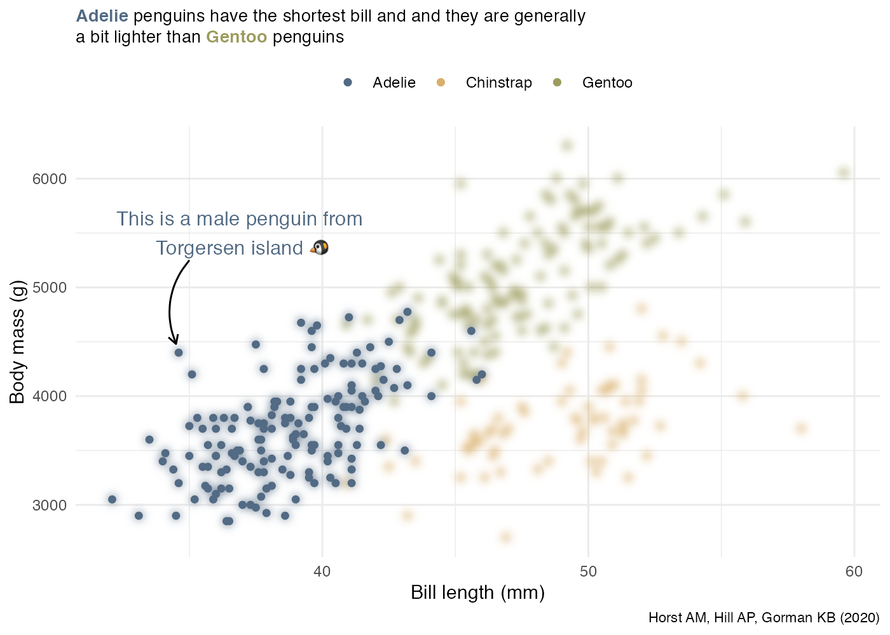

# Better data communication with `{ggplot2}`, part 2

## Using `{ggfx}`, `{ggforce}` and `annotate()`

In my previous article about how to improve data communication with
`{ggplot2}` I have focused on the `{forcats}` package to reorder
categorical data, on using colours to highlights parts of the plot and
to use text to make our message to stand out. In this article, I would
like to build upon those concepts to further improve our data
communication skills using `{ggfx}` and `{ggforce}` to again highlight
parts of the data we want our audience to focus on.

For this exercise, we are going to use the Palmer Archipelago
(Antarctica) penguin data that is available through the
`{palmerpenguis}` R package. You will find many examples of very good
visualisations of this dataset, done in `{ggplot2}` such as the
Tidytuesday contributions by [Cara
Thompson](https://github.com/cararthompson/tidytuesdays/blob/master/scripts/202007d_penguins.R)
and [Cedric
Sherer](https://www.behance.net/gallery/101517403/Bill-Dimensions-of-Penguins).

### `{ggfx}` to highlight parts of the data

`{ggfx}` is a newly released package by [Thomas Lin
Pedersen](https://ggfx.data-imaginist.com) that provides a set of
filters that are applicable to `{ggplot2}` geoms. The one that we are
going to use now is `with_blur()`, which blurs the layers to which it is
applied. In our case, we will blur all the points that we do not want to
highlight. This same concept is for instance applied in photography
where we would blur the background of images so to focus the attention
on the details we have chosen. When visualising data we can do the same,
blur all the details that we do not want our audience to focus on.

``` r
#install.packages("palmerpenguins")

library(dplyr)
library(ggfx)
library(readr)
library(ggplot2)
library(ggforce)
library(stringr)
library(gghighlight)
library(palmerpenguins)
```

The plot below would be our starting point for all the techniques that
we will see on how to highlights certain parts of the chart. We are
using `{ggtext}` to color parts of the title using HTML syntax and by
calling `ggtext::element_markdown()` in the `theme()` to make sure the
HTML code is correctly parsed.

``` r
manual_palettes <- c("#526A83", "#D9AF6B", "#9C9C5E")

ggplot(data = penguins,
       aes(x = bill_length_mm,
           y= body_mass_g,
           color = species)) +
  geom_point() +
  geom_point(data = penguins %>% filter(species == "Adelie")) +
  scale_color_manual(values = manual_palettes)+
  labs(y = "Body mass (g)",
       x = "Bill length (mm)",
       color = "", 
       title = "<span style = 'font-size:10pt'><b style='color:#526A83'>Adelie</b> penguins have the shortest bill and \n and they are generally<br> a bit lighter than <b style='color:#9C9C5E'>Gentoo</b> penguins </span>",
       caption = "Horst AM, Hill AP, Gorman KB (2020)") +
  theme_minimal() +
  theme(legend.position = "top",
        plot.title = ggtext::element_markdown(),
        plot.caption = element_text(size = 8))
```

    ## Warning: Removed 2 rows containing missing values (geom_point).

    ## Warning: Removed 1 rows containing missing values (geom_point).

<!-- -->

Our base plot examines body mass versus bill length, and we can see from
the data that Adelie penguins have the shortest bill.

> Now, how can we highlight the Adelie penguins?

The standard way of doing it would be to color the other categories in a
rather dull greyish color, and have a more vibrant color for Adelie
penguins.Recent developments in the R package landscape have however
broadly expanded our tool kit and allow us to experiment a little bit
more.

We have indeed chosen to apply thefunction `with_blur()` from `{ggfx}`
library to `geom_point()`. With this, we can first blur all the points,
and then we can overlap on top another `geom_point()` layer applied to
only the data corresponding to the Adelie penguins.

You can see from the code below that the first `geom_point()` is wrapped
in `with_blur()`, this is what does the trick.

``` r
ggplot(data = penguins,
       aes(x = bill_length_mm,
           y= body_mass_g,
           color = species)) +
   with_blur(
  geom_point(),
  sigma = unit(0.9, 'mm') # you can choose the amount of blur 
  ) +
  geom_point(data = penguins %>% filter(species == "Adelie")) + # non blurred points
  scale_color_manual(values = manual_palettes) +
  labs(y = "Body mass (g)",
       x = "Bill length (mm)",
       color = "", 
       title = "<span style = 'font-size:10pt'><b style='color:#526A83'>Adelie</b> penguins have the shortest bill and \n and they are generally<br> a bit lighter than <b style='color:#9C9C5E'>Gentoo</b> penguins </span>",
       caption = "Horst AM, Hill AP, Gorman KB (2020)")+
  theme_minimal() +
  theme(legend.position = "top",
        plot.title = ggtext::element_markdown(),
        plot.caption = element_text(size = 8))
```

    ## Warning: Removed 2 rows containing missing values (blurred_geom).

    ## Warning: Removed 1 rows containing missing values (geom_point).

<!-- -->

The advantage of it, compared to just coloring the points of Chinstrap
and Gentoo in a dull greys color, is that we do not remove all the info
from the plot, we really just make the info we are interested in stand
out. For example, when doing a presentation, transitioning between the
first plot and the the `{ggfx}` version of it would be a very good
choice if we want to focus our audience’s attention to Adelie penguins.

### Using `{ggforce}` to annotate

Another way in which we can make the Adelie penguins stand out, and
`Cedric Scherrer` has provided many examples on it, it is by drawing an
ellipse on top on the data of interest. We can even keep the blurry
effect to be as explicit as possible.

To draw an ellipse we can use `geom_mark_ellipse()` from the `{ggforce}`
package.

<!-- -->

`geom_mark_ellipse()` and all `geom_mark_*` functions are highly
customisable, so you can really adjust the ellipse, the arrow and the
annotation the way you want it. For instance, in this case I have
defined the length of the arrow, the direction of the arrow, the
distance at which we want the line to stop (`con.cap`) and we have
removed the legend.

You can see also from the code that a `filter` argument can be specified
directly in this function, making it really easy to choose which subset
of data you want to target.

``` r
ggplot(data = penguins %>% filter(!is.na(bill_length_mm)),
       aes(x = bill_length_mm,
           y= body_mass_g,
           color = species)) +
   with_blur(
  geom_point(),
  sigma = unit(0.8, 'mm')
  ) +
    geom_mark_ellipse(aes(
                        label = species,
                        filter = species == 'Adelie'),
                      con.colour  = "#526A83",
                      con.cap = 0,
                      con.arrow = arrow(ends = "last",
                                        length = unit(0.5, "cm")),
                      show.legend = FALSE) +
  geom_point(data = penguins %>% filter(species == "Adelie")) +
  scale_color_manual(values = manual_palettes) +
  labs(y = "Body mass (g)",
       x = "Bill length (mm)",
       color = "", 
       title = "<span style = 'font-size:10pt'><b style='color:#526A83'>Adelie</b> penguins have the shortest bill and \n and they are generally<br> a bit lighter than <b style='color:#9C9C5E'>Gentoo</b> penguins </span>",
       caption = "Horst AM, Hill AP, Gorman KB (2020)") +
  theme_minimal() +
  theme(legend.position = "top",
        plot.title = ggtext::element_markdown(),
        plot.caption = element_text(size = 8))
```

    ## Warning: Removed 1 rows containing missing values (geom_point).

<!-- -->

All these techniques, i.e. blurring, drawing ellipses, and annotation
that stands out, are very valid and you may choose one or the other, or
combine both, like in this example, for a very striking effect.

### `annotate()`

Whenever you main focus is not on a set of data points but rather on
detailed features of the data, `annotate()`, from `{ggplot2}` is what
you need. Whereas in `{ggforce}` our annotation was limited by the
labels in our data, if we want to have more elaborate descriptions we
can use `annotate()` to place explanatory text on our plot.

For instance, in this case we have decided to add text and an arrow by
calling `annotate()` twice, once for placing the text in the wanted
position and the second time by adding an arrow. As you can see for the
code below `annotate()` gives you a lot of freedom of customisation, but
this come at a price. The placement of annotation layers is a rather
“manual” affair, making it a bit less easy to reproduce on different
plots, should you need to reuse the same code.

As you can see below, we were able to specify the start and end
coordinates of the curve and specified the length of the arrow.

We have also used a recent R development, the `{ragg}` library to print
emojis on our chart. Make sure you have it install and you use
`dev="ragg_png"` in your R chuck options if you want it to print
correctly.

``` r
ggplot(data = penguins,
       aes(x = bill_length_mm,
           y= body_mass_g,
           color = species)) +
   with_blur(
  geom_point(),
  sigma = unit(0.9, 'mm')
  ) +
  geom_point(data = penguins %>% filter(species == "Adelie")) +
  annotate(geom = "text", x = 37, y = 5500, 
           label = glue::glue("This is a male penguin from \n Torgersen island {emo::ji('penguin')}"), 
           size = 4, color ="#526A83" )+
  annotate(
    geom = "curve", x = 35, y = 5250, xend = 34.5, yend = 4480, 
    curvature = .3, arrow = arrow(length = unit(2, "mm"))
  ) +
  
  scale_color_manual(values = manual_palettes) +
  labs(y = "Body mass (g)",
       x = "Bill length (mm)",
       color = "", 
       title = "<span style = 'font-size:10pt'><b style='color:#526A83'>Adelie</b> penguins have the shortest bill and \n and they are generally<br> a bit lighter than <b style='color:#9C9C5E'>Gentoo</b> penguins </span>",
       caption = "Horst AM, Hill AP, Gorman KB (2020)")+
  theme_minimal() +
  theme(legend.position = "top",
        plot.title = ggtext::element_markdown(),
        plot.caption = element_text(size = 8))
```

    ## Warning: Removed 2 rows containing missing values (blurred_geom).

    ## Warning: Removed 1 rows containing missing values (geom_point).

<!-- -->

Overall, I feel the new `with_blur()` may have some very interesting
applications in data communications and I would definitely encourage you
to try it and experiment it a bit by yourself. Being able to borrow
concepts from other fields, such a photography, and apply them to data
visualisation makes me very exited about times to come. Let’s see what
the new developments will bring\!
